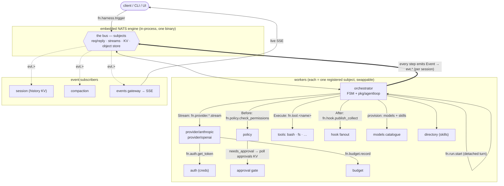

# vent

**A composable agent harness in Go, where an _embedded_ NATS server is the broker.**

> ### ⚠️ This is vibecoded
> `vent` was built fast, with an AI agent, as a **concept spike** — not a
> production system. The point wasn't to ship a harness; it was to answer one
> question end-to-end with real code: *what happens if you take the
> "build-your-own-harness" idea and make the message broker an **embedded**
> NATS+JetStream engine inside a single Go binary?* It builds, it's traced, it
> runs real turns against real models, and there's a passing multiplayer test —
> but treat it as a proof-of-concept and a thinking tool, not a dependency.
> Expect rough edges (see [What we learned](#what-we-learned)).

## The concept

The idea comes from [@mfpiccolo's post][post] on iii.dev's *"you don't build a
harness, you compose one"* thesis: a production agent harness is ~15 separate
jobs (the loop, provider routing, credentials, policy, approvals, budget,
skills, events, tracing…) that frameworks bundle into a monolith. iii unbundles
them into **workers** on a shared runtime, each replaceable, connected by one
primitive — a trigger.

iii's engine is **Rust + WebSocket workers**. `vent` asks the follow-on
question: **what if the runtime is just embedded NATS?** NATS already _is_ a
request/reply bus + a durable event log + a work queue + a KV store + an object
store + clustering — i.e. most of "the engine" is a hardened dependency you
don't write. So here, every harness job is a worker that registers a NATS
subject, the broker is `nats-server` running **in-process** (no sidecar, no
Docker, one `go build`), and the agent loop (`pkg/agentloop`) is a faithful Go
port of [pi][pi]'s loop, kept transport-agnostic.

To change how the harness behaves you **swap a worker**, not the harness.

[post]: https://x.com/mfpiccolo/status/2060069083878408689
[iii]: https://iii.dev
[pi]: https://github.com/badlogic/pi-mono

---

## The thesis

A harness is usually a monolith: one process that owns model calls, tool
execution, permissioning, logging, and the loop, all entangled. vent inverts
that. There is exactly **one primitive** — a worker registers a subject and
becomes the implementation of a job; anyone calls that job with
`b.Trigger(ctx, subject, req, &out)`. That's it.

- Want a different permission model? Register `fn.policy.check_permissions`.
- Want a new model provider? Register `fn.provider.<name>.stream`.
- Want a new tool? Register `fn.tool.<name>`.

The orchestrator doesn't know or care who answers — it just triggers the
subject. Workers only agree on the JSON shapes in `pkg/types`. The full rules
for writing one are in [`docs/WORKER_CONTRACT.md`](docs/WORKER_CONTRACT.md);
the short version is each worker is a package `workers/<name>/` exposing
`func Start(ctx context.Context, b *bus.Bus) error` that registers its subjects
and returns.

---

## The harness jobs

Every layer of the harness is one of these workers. Function subjects are
request/reply (a function call); event subjects are JetStream streams.

| Job | Worker | Subject(s) |
| --- | --- | --- |
| Accept a turn from a client (public entrypoint) | `orchestrator` | `fn.harness.trigger` |
| Start the durable turn loop | `orchestrator` | `fn.run.start` |
| Stream an assistant message from a provider | `provider/anthropic` | `fn.provider.anthropic.stream` |
| Stream from any OpenAI-compatible endpoint (OpenAI, OpenCode Zen, Ollama, vLLM) | `provider/openai` | `fn.provider.openai.stream` |
| Context compaction when the window fills | `compaction` | subscribes `evt.>` (no fn subject) |
| Credential vault (resolve API tokens) | `auth` | `fn.auth.get_token` |
| Model catalogue | `models` | `fn.models.list`, `fn.models.get`, `fn.models.supports` |
| Policy engine (allow / deny / needs-approval) | `policy` | `fn.policy.check_permissions` |
| Human-in-the-loop approval gate | `approval` | `fn.approval.resolve` |
| Spend tracker | `budget` | `fn.budget.record`, `fn.budget.check` |
| Skill bodies + listing | `directory` | `fn.directory.skills.get`, `fn.directory.skills.list` |
| Before/after hook fanout | `hookfanout` | `fn.hook.publish_collect` |
| Bash tool | `tools/bash` | `fn.tool.bash` |
| Filesystem tools | `tools/fs` | `fn.tool.<name>` (per registered tool) |
| Session history (persist messages) | `session` | subscribes `evt.>` (no fn subject) |
| Events gateway (HTTP/SSE fanout) | `events` | subscribes `evt.>`, serves `127.0.0.1:8088` |

Subject and bucket names live in [`pkg/bus/subjects.go`](pkg/bus/subjects.go).
Provider and tool subjects are dynamic — `bus.ProviderStreamSubject(name)` and
`bus.ToolSubject(name)` — which is exactly why adding one is just registering a
string.

---

## Architecture: one turn, end to end

A turn flows through the bus as a chain of triggers and a stream of events. The
orchestrator owns a small finite state machine (`types.TurnState.Phase`:
`Provisioning → Assistant → FunctionExecute → AwaitingApproval → Stopped/Failed`)
but never executes the work itself — it delegates every step to another worker.



**More diagrams from different angles** — substrate mapping, the turn as a
sequence, the FSM, the loop seams, the human-approval KV-watch, streaming, trace
propagation, deployment modes, and multiplayer — are in
[`docs/DIAGRAMS.md`](docs/DIAGRAMS.md).

The same flow as a call/event trace:

```
client
  │  b.Trigger("fn.harness.trigger", RunRequest)
  ▼
orchestrator ── fn.harness.trigger ──► fn.run.start   (seed TurnState, return immediately;
  │                                                     the turn runs on a detached goroutine)
  ▼
agentloop.Run  (pkg/agentloop — the pi port)
  │
  ├─ Stream ──► fn.provider.anthropic.stream
  │               provider resolves creds via fn.auth.get_token,
  │               streams deltas over core subject stream.<session>.<msg>,
  │               records spend via fn.budget.record
  │
  ├─ Before ─► fn.policy.check_permissions
  │               allow        → run
  │               deny         → blocked tool result
  │               needs_approval → park in AwaitingApproval,
  │                                poll approvals KV until fn.approval.resolve
  │
  ├─ Execute ► fn.tool.<name>            (bash, fs, …)
  │
  └─ After ──► fn.hook.publish_collect   (post-tool hook fanout, best-effort)

       every step emits types.Event ──► evt.<session>  (JetStream AGENT_EVENTS)
                                          │
                            ┌─────────────┴─────────────┐
                            ▼                            ▼
                     session worker               events worker
                  (append to history KV)        (HTTP/SSE to clients)
```

The loop's `Stream`/`Execute`/`Before`/`After` callbacks are the seams: the loop
calls them, the orchestrator wires each one to a bus trigger. Policy + approval
live behind `Before`; hook fanout + budget side effects live behind `After`.
Swapping any of them is swapping a worker, not editing the loop.

---

## Why NATS

The whole point is that one embedded binary gives you every communication
pattern a harness needs, with no broker to operate:

| Need | NATS feature | In vent |
| --- | --- | --- |
| Call another job, get a result | request/reply | `b.Trigger` → a worker's `Register`ed subject — a function call over the wire |
| An event log / durable trigger | JetStream stream | `AGENT_EVENTS` (`evt.>`, replayable) and `TURN_STEPS` (`turn.step.>`, work queue) |
| Mutable state | KV buckets | `sessions`, `turn_state`, `approvals`, `budgets`, `tools`, `skills` |
| Large payloads / blobs | Object Store | `blobs` |

The engine ([`internal/engine/engine.go`](internal/engine/engine.go)) starts the
server in-process with `DontListen: true` — no TCP socket, no external dependency.
Workers connect in-process. Because they only ever speak the bus, the exact same
code runs unchanged against a remote NATS cluster: a worker becomes a real
separate process and the harness becomes distributed for free.

---

## Observability / tracing

The bus is the trace boundary. On every `b.Trigger`, the bus injects W3C trace
context (`traceparent`) plus session baggage into the NATS message headers; on
the responding side, `b.Register` extracts them and starts its handler span as a
child. The result: **one turn is one connected trace**, spanning every worker
that participated — provider, auth, policy, tools, hooks — with no per-worker
tracing code. Workers just thread the `ctx` they're handed into their own
`Trigger` calls and the spans nest automatically.

The orchestrator roots the per-turn span on its detached turn goroutine via
[`pkg/obs.StartTurn`](pkg/obs/obs.go), which also seeds `vent.session.id` into
OTel baggage. Because baggage rides the same headers, every downstream span
carries the session id — that's the "group by session" view for free.

```bash
# See the whole turn as spans on stdout.
VENT_TRACE=stdout ./vent doctor
```

`pkg/obs` is the only place that touches the OTel SDK; everything else uses the
API + the globally-installed propagator. The stdout exporter is wired today and
**OTLP is a drop-in** — swap the exporter in `obs.Init` and the same spans flow
to a collector. With `VENT_TRACE` unset, spans are non-recording, so propagation
has nothing to inject and overhead stays negligible.

---

## Multiplayer / external workers

`vent serve` opens a real NATS client socket (`VENT_NATS_LISTEN`, default
`127.0.0.1:4222`). Any process — another Go binary, or a Python/Rust process
using a stock NATS client — connects over `nats://`, calls `bus.Connect`, and
registers a function subject: `fn.tool.<name>`, `fn.provider.<name>.stream`,
`fn.policy.check_permissions`, and so on. The orchestrator dispatches by subject
and **never knows the worker is remote** — in-process or across a machine, it's
the same `b.Trigger`.

```bash
# Terminal 1: bring up the harness with its socket open.
./vent serve

# Terminal 2: register an external "echo" tool from a separate process.
VENT_NATS_URL=nats://127.0.0.1:4222 go run ./examples/external-worker
# fn.tool.echo is now callable by the orchestrator — from a different process.
```

See [`examples/external-worker`](examples/external-worker). This is exactly how
"build your own harness = swap a worker" stops being a single-process trick and
holds across process and machine boundaries: the contract is the subject, not
the binary.

---

## Clustering / scale

Run multiple engines as a NATS cluster by setting three env vars on each node:

| Env var | Meaning |
| --- | --- |
| `VENT_CLUSTER_NAME` | shared cluster name (same on every node) |
| `VENT_CLUSTER_LISTEN` | this node's cluster `host:port` |
| `VENT_CLUSTER_ROUTES` | comma-separated `nats-route://host:port` URLs of the peers |

With routes wired, subjects, the JetStream event log (`AGENT_EVENTS`), KV state
and the `TURN_STEPS` work queue replicate/route across nodes. The scale story
falls out of NATS primitives:

- **Load balancing.** Every `Register` joins a queue group keyed on the subject,
  so function calls are load-balanced across all instances of a worker. Run N
  orchestrators and N providers and the work spreads automatically — no router.
- **Concurrency per node.** Goroutine-cheap handlers mean a single engine
  serves many concurrent sessions at once.
- **Horizontal scale.** Add cluster nodes and/or more worker instances; the
  queue groups absorb them with no config change.
- **Multiplayer.** Many clients can subscribe to the same `evt.*` event streams,
  so any number of UIs follow the same turns live.

---

## Quickstart

```bash
go build ./cmd/vent          # one static binary: engine + every worker

./vent doctor                # offline: boot engine, provision streams/KV/blobs,
                             # verify all 15 workers register. No network, no key.
```

Requires Go 1.26+. `doctor` is the offline contract test — if a worker fails to
register, it fails here, before any model is called.

## Reproduce the results

Everything below was run on this repo. Nothing here needs an external broker.

**1. Build + offline wiring check (no API key):**
```bash
go build ./cmd/vent && ./vent doctor
# → vent: harness OK (15 workers, 5 tools, 5 models)
```

**2. One turn = one connected OTel trace across workers:**
```bash
VENT_TRACE=stdout ./vent doctor
# Spans like "trigger fn.models.list" (client) and "handle fn.models.list"
# (server) share a TraceID with Parent.Remote=true → context crossed the bus.
```

**3. Multiplayer over the socket (a function registered on one connection,
   called from another) — a passing test:**
```bash
go test ./examples/external-worker/ -run TestEchoOverNetwork -v
# → PASS  (echo tool registered on a 2nd NATS connection, dispatched to over the bus)
```

**4. A real agentic turn — OpenAI-compatible provider (works against OpenAI,
   or any compatible gateway):**
```bash
export OPENAI_API_KEY=sk-...                 # your key
export OPENAI_BASE_URL=https://api.openai.com/v1   # or e.g. https://opencode.ai/zen/v1
VENT_PROVIDER=openai VENT_MODEL=gpt-5.5 VENT_WORKDIR="$PWD" \
  ./vent run "Use the ls tool to list files here, then say what kind of project this is."
```
Observed trace (gpt-5.5 via an OpenAI-compatible gateway):
```
[agent start] … [turn start]
[tool start] ls
hookfanout: phase=after tool=ls
[tool end] ls (ok)
[turn end] [turn start]
This is a Go project … called "vent" with workers, internal packages, docs, and examples.
[turn end] [agent end]
```
That's the full loop: model emits a tool call → `policy.check_permissions`
allows it → `fn.tool.ls` runs → result fed back → second turn answers. Swapping
to Anthropic is one flag: `VENT_PROVIDER=anthropic VENT_MODEL=claude-haiku-4-5
ANTHROPIC_API_KEY=… ./vent run "…"`.

**5. Watch live, or go multiplayer:**
```bash
./vent serve   # opens the bus socket (127.0.0.1:4222) + SSE at /events
# then, from another process / machine, register your own worker:
VENT_NATS_URL=nats://127.0.0.1:4222 go run ./examples/external-worker
```

---

## Swap a worker

This is the feature, not a footnote. Because a job *is* whoever registers its
subject, replacing one is mechanical:

**Replace the policy engine.** Write a worker that registers
`fn.policy.check_permissions` and returns a `types.PolicyResult`
(`allow` / `deny` / `needs_approval`). Drop the default `policy` worker from the
binary's `Start` list and add yours. The orchestrator's `Before` gate keeps
triggering the same subject — your logic now decides every tool call.

```go
// workers/mypolicy/mypolicy.go
func Start(ctx context.Context, b *bus.Bus) error {
    _, err := b.Register(bus.SubjPolicyCheck, func(ctx context.Context, data []byte) (any, error) {
        var req types.PolicyRequest
        json.Unmarshal(data, &req)
        // your rules…
        return types.PolicyResult{Decision: types.PolicyAllow}, nil
    })
    return err
}
```

**Add a model provider.** Register `fn.provider.<name>.stream`, implement
`types.StreamRequest → types.StreamResponse`, and own the assistant
`message_start`/`message_update`/`message_end` events plus the delta stream on
the core subject the orchestrator hands you. Tell the orchestrator to route to
`<name>` and it triggers `bus.ProviderStreamSubject("<name>")` with no other
change. The `provider/anthropic` worker is the reference implementation
(standard library `net/http` only).

**Add a tool.** Register `fn.tool.<name>`. The loop dispatches to it by name the
moment the model emits a call for it — see `tools/bash` and `tools/fs`.

Same move every time: register the subject, the harness routes to you.

---

## Patterns that emerge from NATS

The interesting part of the spike: once the broker is NATS, a bunch of harness
concerns stop being code you write and become *a way you use a subject*. Each of
these fell out of the substrate rather than being designed in:

- **Function call = request/reply.** `b.Trigger(subject, req, &out)` over a
  subject *is* an RPC. A worker that `Register`s the subject is the impl. No
  router, no service registry — the subject is the contract.
- **Hot-swap / A-B a worker = who's subscribed.** A job is whoever answers its
  subject. Replace policy/provider/tool by starting a different process; stop the
  old one to cut over.
- **Horizontal scale = queue groups.** Every `Register` joins a queue group, so
  N identical workers load-balance a subject automatically. Run 10 bash workers,
  10 orchestrators — work spreads with zero config.
- **Durable FSM = a work-queue stream.** `TURN_STEPS` (JetStream work queue)
  lets the per-turn state machine be woken by published steps and survive
  restarts — the turn is durable, not in-memory.
- **Reactive approvals = KV watch.** The human-in-the-loop gate is just a worker
  writing a key and the orchestrator watching the `approvals` bucket. No bespoke
  callback channel — state changes *are* the event.
- **Live UI + replay = the same event stream.** Workers publish `evt.<session>`;
  the SSE gateway tails it live while JetStream retains it for replay. Many
  subscribers = multiplayer for free.
- **Distributed tracing = message headers.** Inject `traceparent` + baggage on
  `Trigger`, extract on `Register`, and one turn is one trace across every
  worker — no per-worker instrumentation.
- **In-process now, distributed later, same code.** The engine runs with
  `DontListen` for a single-binary dev loop; flip on a listener and workers are
  separate processes; add cluster routes and it's HA across machines — the
  worker code never changes.
- **Edge / sandbox / multi-tenant (available, not yet used here).** NATS leaf
  nodes let a sandbox or laptop join a central cluster with local subjects;
  accounts give per-tenant subject isolation. These are bus features, so they'd
  drop in without touching worker logic.

## What we learned

Honest findings from the spike, grouped by what they tell you.

### What worked — the bet paid off

- **Embedded NATS is a genuinely good harness substrate.** Most of "the engine"
  iii writes in Rust (routing, a durable event log, a work queue, KV, blobs,
  clustering) is *one dependency* here. The whole thing is `go build` → a single
  binary with no broker to operate. The "in-process now, networked later,
  clustered after that — same worker code" property held end to end.
- **The swap thesis is real and cheap.** Adding the OpenAI-compatible provider
  was one new `workers/provider/openai/` package plus one row in the model
  catalogue — the orchestrator and loop never changed. A second provider, a new
  tool, or a different policy engine is the same move: register the subject.
- **Contract-first is what made it AI-parallelizable.** Freezing `pkg/types`
  (wire shapes) and `pkg/bus` (the primitive) *first*, then fanning out one
  agent per worker, worked because the workers are decoupled and share only that
  contract. The decomposition that makes the harness composable for humans is
  the same one that makes it generatable in parallel. That's the reusable lesson.
- **The pi loop port stayed clean.** Keeping `pkg/agentloop` transport-agnostic
  (it never imports NATS; it exposes Stream/Before/Execute/After) meant all the
  bus wiring lives in the orchestrator. The seam held — you can unit-test the
  loop with fakes and never touch the broker.
- **Streaming + a final reply in one call maps naturally.** A provider publishes
  token deltas to a core subject the orchestrator tails, and returns the
  finalized message as the request reply. Live tokens *and* a clean result with
  no extra machinery.
- **OTel across a message bus is basically free.** Inject `traceparent` +
  baggage into NATS headers on `Trigger`, extract on `Register`, and one turn is
  one connected trace across every worker — zero per-worker instrumentation.

### What surprised us — sharp edges & gotchas

- **JetStream KV keys are restricted** to `[-/_=.a-zA-Z0-9]`. A worker used `::`
  in skill keys and boot died with `nats: invalid key`. Switched to `.`. Cheap
  bug, easy to hit — sanitize anything you put in a KV key.
- **Queue groups ≠ iii's "latest registration wins."** NATS load-balances within
  a queue group, so two instances of a worker *share* traffic. To truly
  *replace* one you drain/stop the old instances — there's no implicit
  most-recent-wins hot-swap. Arguably safer, but a different mental model.
- **A detached durable turn can't reuse the request context.** `fn.run.start`
  returns immediately and the turn runs on a background goroutine, so the
  request's ctx (and its span) is already over. The trace root has to be
  re-established on the goroutine (`obs.StartTurn`) or the turn shows up
  parentless. Durability and tracing pull in opposite directions here.
- **Trace propagation forced a transport detail.** Plain `nc.Request` carries no
  headers, so `Trigger` had to switch to building a `nats.Msg` with headers +
  `RequestMsgWithContext`. The propagation requirement reached down into how the
  call is made.
- **A catalogue miss shouldn't strand a provider.** A model id the static
  catalogue doesn't know (e.g. a gateway-only model) first fell back to the
  hard-coded Anthropic model — wrong provider. Fix was to make resolution
  *trust the request* so any provider/model routes.
- **Models do weird things; make them visible.** `gpt-5.5` occasionally returned
  an empty assistant turn after a tool result. Not a bug in vent — but the run
  trace hid it because it only printed text deltas. Surfacing stop-reasons and
  errors in the trace made the behavior legible. Observability earns its keep
  fast.

### What we'd fix before trusting it

- **Budget needs compare-and-swap.** The `budget` worker does best-effort
  read-modify-write on KV, which races under concurrent turns. JetStream KV has
  revision-based CAS (`Update` with the last revision) — that's the right fix,
  not yet applied.
- **Approvals should watch, not poll.** The gate polls the approvals bucket every
  500 ms; a KV *watch* is the truly reactive version (and what iii's
  `turn::on_approval` does).
- **Security for real multiplayer.** External workers currently connect
  unauthenticated. Before opening the socket beyond localhost you'd want NATS
  TLS + JWT/nkey auth and per-subject permissions — all native to NATS, just not
  configured here.
- **Compaction is naive** (token estimate = chars/4, one flat summary) and there
  is **one real test** in the repo. Coverage and error-handling uniformity are
  the obvious next debts.

### Meta

It's **vibecoded** — built mostly by an AI agent in a few iterations. The value
isn't the code quality; it's that the architectural bet ("a harness is workers
on a bus; swap a worker, not the harness") survived contact with a real,
running, traced, multi-provider implementation. Concept proven; production
hardening explicitly not attempted.

## Layout

```
cmd/vent/              composite binary: starts the engine, calls every worker's Start
internal/engine/       embedded NATS server + stream/KV/object-store provisioning
pkg/bus/               the primitive: Register, Trigger, PublishEvent, KV, blobs, subjects
pkg/agentloop/         the pi loop port — transport-agnostic per-turn state machine
pkg/obs/               OTel wiring: propagator + per-turn root span (the only SDK user)
pkg/types/             every wire shape (do not add fields; use what's there)
workers/               one directory per harness job (see table above)
examples/external-worker/  a worker in its own process + the multiplayer test
docs/WORKER_CONTRACT.md  read this before writing a worker
```
