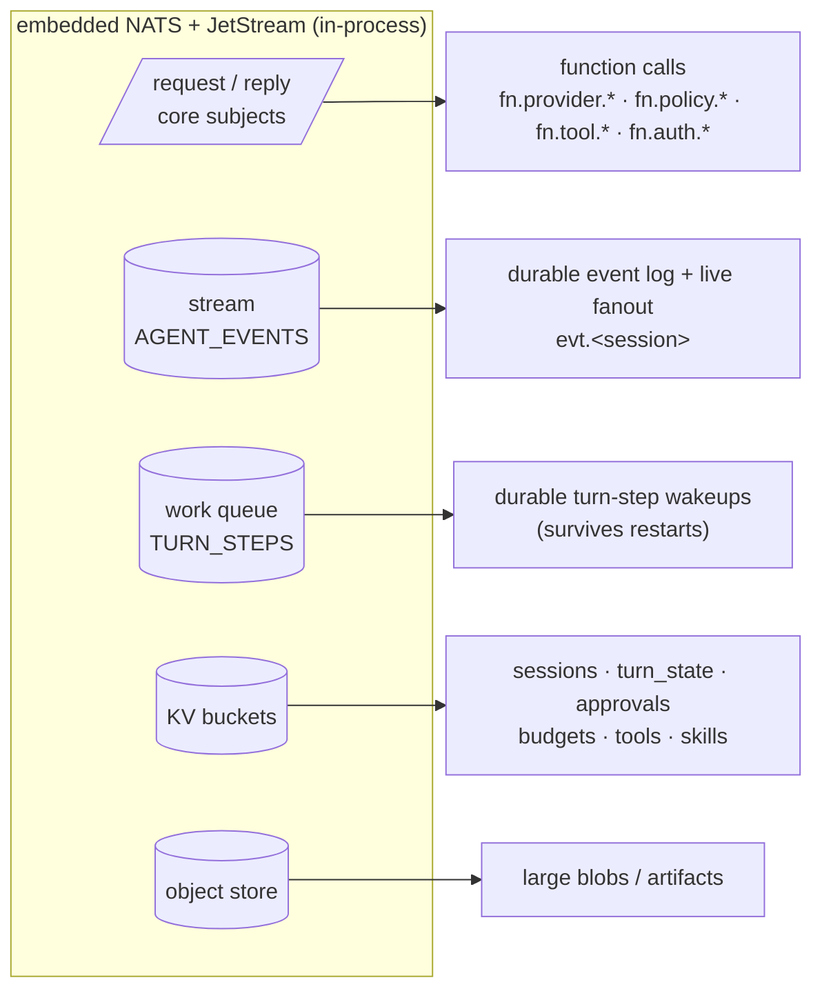
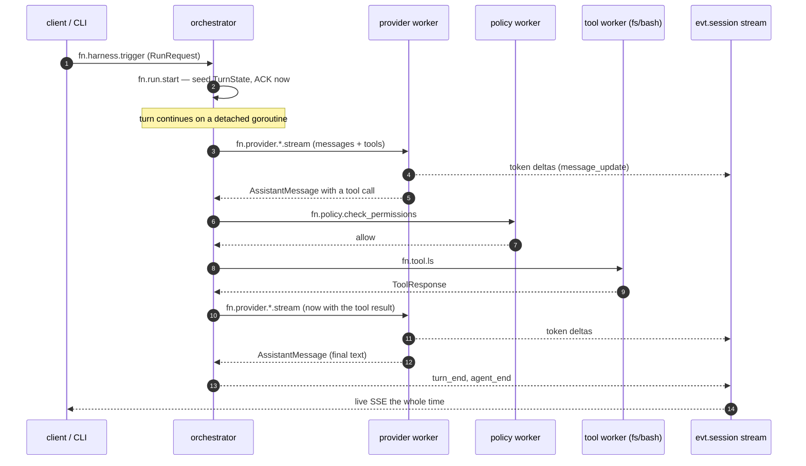
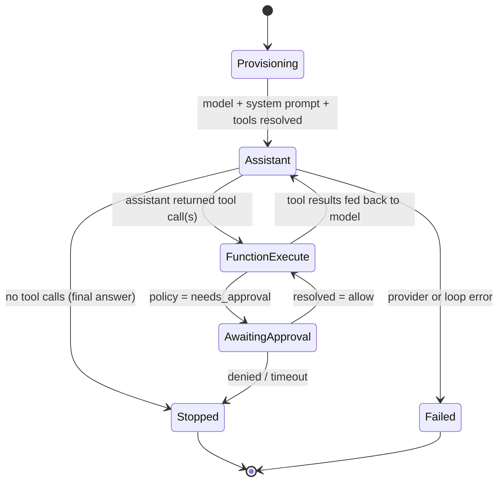
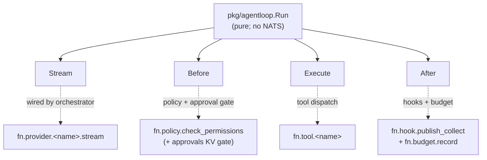
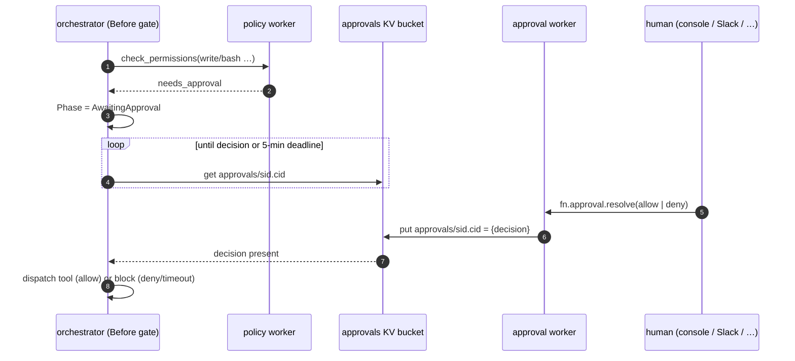
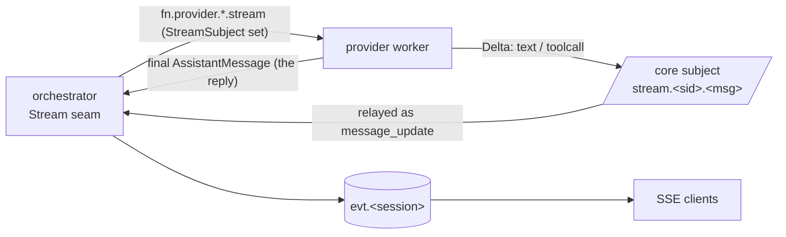
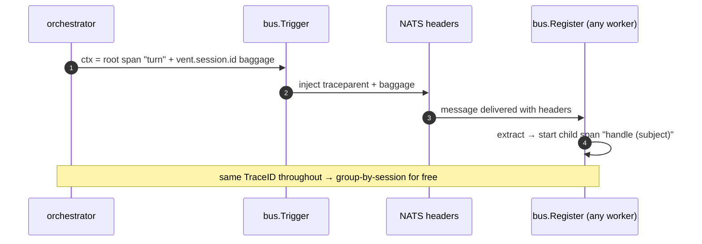
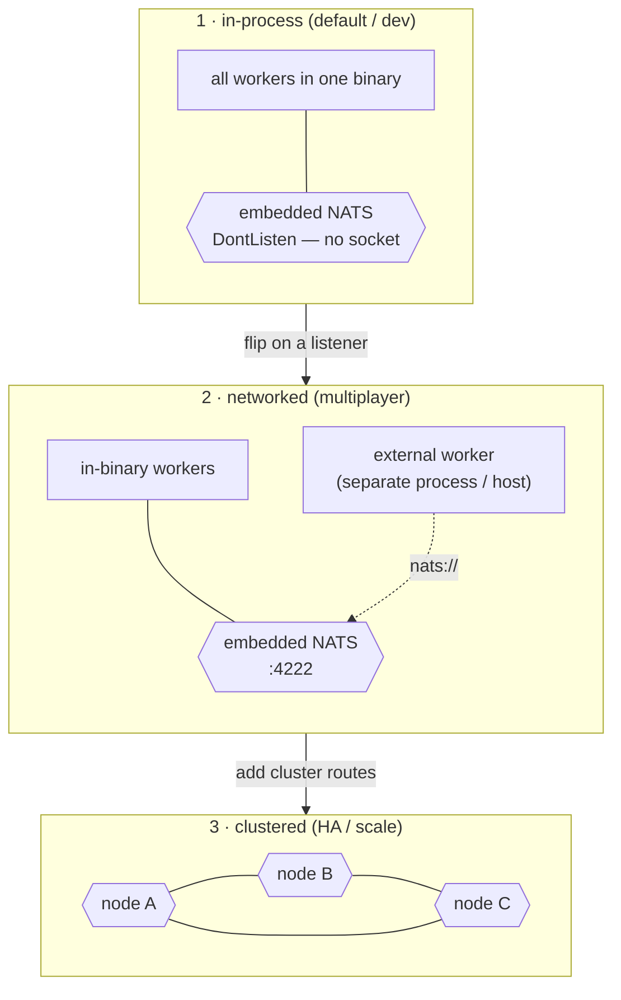
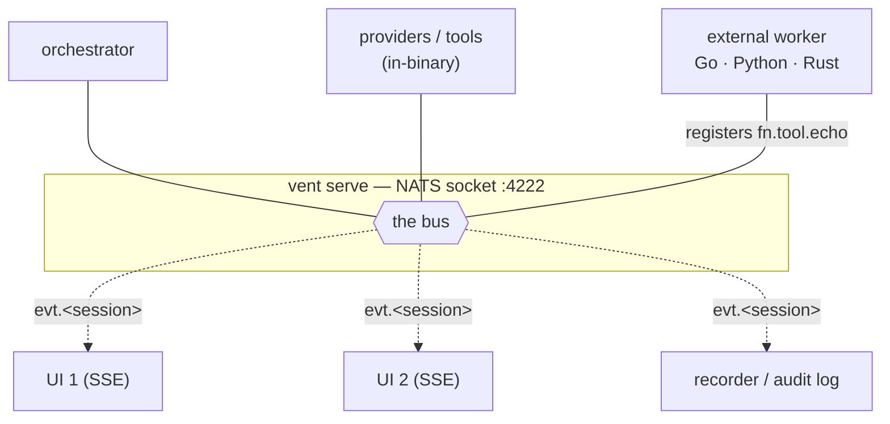

# vent, from several angles

A visual tour of the harness. Each diagram looks at the same system through a
different lens — the substrate, one turn over time, the state machine, the loop
seams, the human gate, streaming, tracing, deployment, and multiplayer. Read
top-to-bottom or jump to the angle you care about.

- [1. The substrate — one NATS primitive per harness concern](#1-the-substrate)
- [2. One turn, over time (sequence)](#2-one-turn-over-time)
- [3. The turn as a state machine](#3-the-turn-as-a-state-machine)
- [4. The loop's four seams](#4-the-loops-four-seams)
- [5. Human-in-the-loop, via KV watch](#5-human-in-the-loop-via-kv-watch)
- [6. Streaming tokens](#6-streaming-tokens)
- [7. One turn = one trace](#7-one-turn--one-trace)
- [8. Three deployment modes, same code](#8-three-deployment-modes-same-code)
- [9. Multiplayer](#9-multiplayer)

---

## 1. The substrate

The bet in one picture: most of "the engine" is just NATS features. Each harness
concern is a different way of *using* the embedded broker — not a service you
build.

> The harness never imports a queue library, a pub/sub library, a KV client, or
> a blob client. It imports `pkg/bus`, which is a thin wrapper over these five.

---

## 2. One turn, over time

The same flow as the README's component diagram, but as a timeline — who calls
whom, in what order, for a turn that makes one tool call.

---

## 3. The turn as a state machine

The orchestrator owns a small FSM (`types.TurnState.Phase`) but executes none of
the work — each transition is driven by a worker's reply.

---

## 4. The loop's four seams

`pkg/agentloop` is transport-agnostic — it knows nothing about NATS. It exposes
four callbacks; the orchestrator wires each to a bus subject. That wiring *is*
the harness's policy/provider/tool/observability stack.

> Swapping any layer = changing which worker answers that subject. The loop is
> untouched.

---

## 5. Human-in-the-loop, via KV watch

Approvals need no bespoke callback channel. The gate is a worker that writes a KV
key; the orchestrator watches the bucket. State change *is* the event.

> Any surface can drive this — a console, a Slack slash-command worker, a CI bot —
> as long as it calls `fn.approval.resolve`. The orchestrator never knows which.

---

## 6. Streaming tokens

The provider streams deltas onto a per-message core subject the orchestrator
subscribes to, and returns the finalized message as the reply. Live tokens *and*
a clean result, with no extra plumbing.

---

## 7. One turn = one trace

Trace context rides the NATS message headers, so a turn is one connected OTel
trace across every worker — with zero per-worker tracing code.

> `VENT_TRACE=stdout ./vent doctor` prints these spans; the stdout exporter is a
> one-line swap to OTLP.

---

## 8. Three deployment modes, same code

The worker code never changes across these. Only how the engine is started does.

---

## 9. Multiplayer

One bus, many participants: workers that answer function subjects, and any
number of observers tailing the same event stream.

> Function calls are queue-group **load-balanced** across instances of a worker
> (scale by starting more); events are **broadcast** to every subscriber
> (multiplayer by default).
